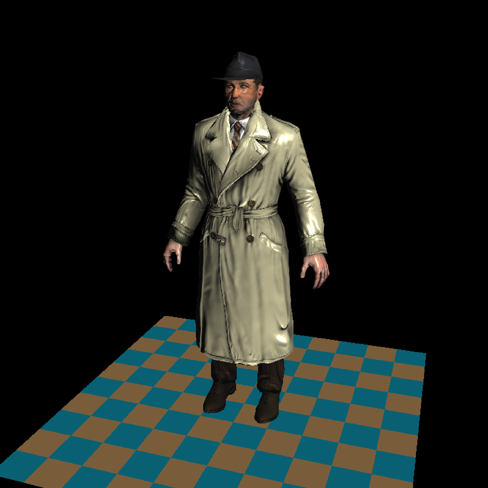

<b>编译</b>  
```g++ *.cpp -o tinyrenderer```  
<b>运行</b>  
```./tinyrenderer <filepath1> <filepath2> ...```  
示例：```./tinyrenderer ./obj/boggie/*.obj ./obj/floor.obj```  
本项目基于开源项目[tinyrenderer](https://github.com/ssloy/tinyrenderer)，是本人在学习完GAMES101后上手实践的一个光栅化渲染器，麻雀虽小，五脏俱全，在代码中渲染的主要流程被很好的体现出来，十分有助于初学者用于巩固和掌握计算机图形学知识  
下面就讲讲本项目的渲染流程吧(核心代码位于[main.cpp](./main.cpp)和[our_gl.cpp](./our_gl.cpp))  
1、首先一个模型由许多三角形面组成，每个三角形面有三个顶点，在Shader的顶点着色器(Vertex)中，负责将模型由其局部坐标系转换到相机坐标系(数学上是乘以Modelview、Projection矩阵)  
2、得到转换后的顶点坐标(clip_vert)后，将其作为参数传入triangle函数(负责一个三角形面的着色)中，在该函数中，首先获得该三角形的包围盒(即能够包围该三角形且处于屏幕内的最小矩形范围)，我们在包围盒中对每个像素进行着色，计算每一个像素的重心坐标，只有当像素在三角形内部且通过重心坐标插值得到的深度小于zbuffer中缓存的深度时，才会对该像素调用Shader的片段着色器(Fragment)进行着色，并同时更新zbuffer  
3、在片段着色器中，会通过重心坐标插值获得当前像素点的法线向量和纹理坐标，纹理坐标即像素点在各个贴图(texture)中的坐标，法线向量主要用于计算光线入射角度，渲染器基于bling phong模型，每个点的着色由环境光(ambient)、漫反射项(diffuse)、高光项(specular)相加获得    
<b>渲染结果示例</b>  
